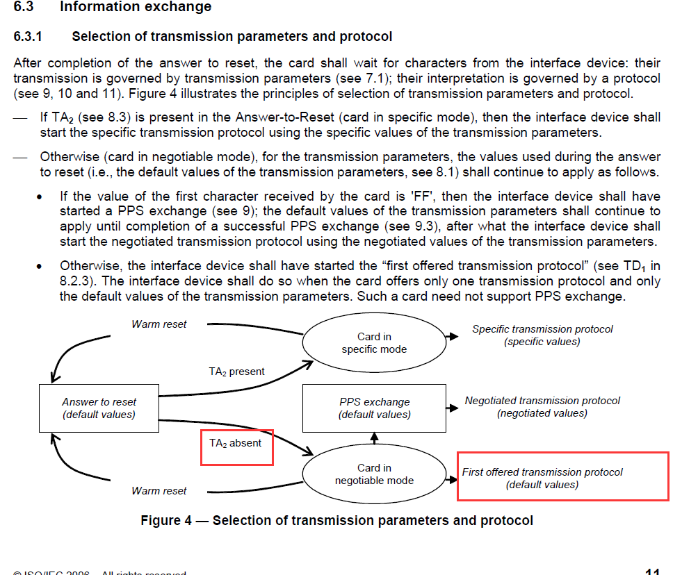

# 1 引脚
|触点|功能|触点|功能|
|----|----|---|----|
|C1|VCC, 供电|C5|GND|
|C2|REST 智能卡|C6|VPP|
|C3|CLK 智能卡时钟|C7|IO|
|C4|保留|C8|保留|

# 2 ATR
ATR格式
|TS|T0| TA1,TB1,TC1,TD1,...,TAi,TBi,TCi,TDi|T1,T2,...,TK|TCK|
|--|--|------------------------------------|------------|---|
> Example:
3F 77 18 00 00 C2 14 00 C1 68 90 00

TS:
> 0x3B:正向约定，HLHHLHHHLLH，高电平表示1，低电平表示0，先发送低字节。
> 0x3F:反向约定，HLHHLHHHLLH，高电平表示0，低电平表示1，先发送高字节。

T0:
|Bit8(msb)|Bit7|Bit6|Bit5|Bit4|Bit3|Bit2|Bit1(lsb)|
|----|-----|------|-----|-----|-----|-----|------|
```
如果Bit8==1，TD1存在。
如果Bit7==1，TC1存在。
如果Bit6==1，TB1存在。
如果Bit5==1，TA1存在。
Bit4-Bit1表示历史字符个数。
```
TD(i)
|Bit8(smb)|Bit7|Bit6|Bit5|Bit4|Bit3|Bit2|Bit1(lsb)|
|---------|----|----|----|----|----|----|---------|
```
如果Bit8==1，TD1存在。
如果Bit7==1，TC1存在。
如果Bit6==1，TB1存在。
如果Bit5==1，TA1存在。
Bit4-Bit1表示使用的协议，T0/T1/T14，接口设备需要支持T0和T1协议，智能卡需要支持T0或T1协议，如果没有TD1则默认使用T0协议。
```

# 3 ETU
> 1 etu =(F/D)*(1/f)
etu的倒数是bps，智能卡的时钟通常在1-5MHZ，上电复位后，默认F=372 D=1，若f=3.5MHZ，约是9600bps。F和D可以根据TA(i)的值进行设置。

# 4 APDU
|Command header|Command body|
|-------------|----------------------------------|
|CLA INS P1 P2 [P3]|[Lc field] [Data field] [Le field]|
> CLA: 命令类型
INS: 指令代码
P1 P2:指令附加特定参数
P3:由INS码决定，可能是传输给IC卡的数据，可能等待IC卡响应的最大长度。
Lc:一个字节，Command body的字节数
Le:希望收到回复的字节数。
>
> 传送完command header会等待卡回复一个过程字节。

# 5 响应
|DATA|SW1|SW2|
|-----|--|---|
>DATA: 卡回复的数据。
SW[1/2]: 状态字

# note
> 1. 传输一个字节，1bit起始，8bit数据，1bit奇偶校验。
> 2. 传输数据，RESET由低拉高，在拉低，DATA线初始状态默认高电平。
> 3. 如果TA2缺失，则使用ATR期间的F和D




[ISO7816-3-接口标准-英文文档](ISO+IEC-7816-3-2006.pdf)

[ISO7816-4-传输协议-英文文档](ISO+IEC-7816-4.pdf)

[ISO7816-4-传输协议-简体中文](https://max.book118.com/html/2021/1120/8135134132004041.shtm)

[T0/T1/T14 协议层实现](drvSC.c)


:joy:
